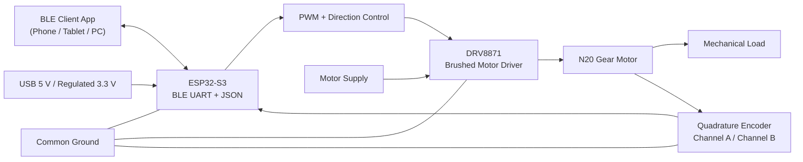

# ESP32-S3 N20 Motor Controller (ESP-IDF C++)

## Introduction

This project demonstrates a compact motion-control node built around the ESP32-S3, a DRV8871 brushed DC motor driver, and a 6 V N20 gearmotor with a quadrature encoder. The ESP32-S3 provides the processing power, Bluetooth Low Energy connectivity, and flexible peripherals needed for embedded motor control, while the DRV8871 delivers efficient bidirectional drive for the motor. The encoder closes the loop by reporting shaft movement back to the controller, allowing the firmware to estimate speed, count position, and respond to load changes in real time. Together, these parts form a practical platform for small robots, linear actuators, feeders, smart locks, and precision mechanisms that need wireless setup or telemetry.

In this design, the ESP32-S3 generates high-frequency PWM signals for the DRV8871 inputs, reads both encoder channels through GPIO interrupts, and exposes a BLE UART-style service that exchanges newline-delimited JSON commands and telemetry. That means a phone, tablet, or desktop application can request open-loop power control, closed-loop speed control, encoder reset, and runtime tuning without a USB cable. The DRV8871 handles the motor current path, keeping the higher current switching away from the microcontroller, while the N20 motor offers a small footprint and gearbox options for torque-focused applications. Because encoder versions of the N20 are widely available, the same control architecture can be reused across many gear ratios by updating only the counts-per-revolution setting and the wiring map. With BLE telemetry, developers can observe live RPM, encoder counts, command output, and controller behavior during testing, which shortens bring-up time and makes it easier to validate wiring, tune PID gains, detect stalls, and compare the response of different motors or gearboxes before finalizing the embedded application design. The result is a clean ESP-IDF C++ example that combines wireless control, motor power, and feedback into a single reusable starting point for custom mechatronics builds.

## System Graphic



## Wiring Summary

| Signal | Connects To | Notes |
| --- | --- | --- |
| ESP32-S3 `GPIO4` | DRV8871 `IN1` | PWM and forward control |
| ESP32-S3 `GPIO5` | DRV8871 `IN2` | PWM and reverse control |
| ESP32-S3 `GPIO6` | Encoder `A` | Use 3.3 V safe logic |
| ESP32-S3 `GPIO7` | Encoder `B` | Use 3.3 V safe logic |
| ESP32-S3 `3V3` | Encoder VCC or level shifter | Do not feed 5 V into GPIO |
| ESP32-S3 `GND` | DRV8871 `GND` and encoder `GND` | All grounds must be common |
| External motor supply | DRV8871 `VM` | Match the motor voltage/current requirement |
| DRV8871 `OUT1` / `OUT2` | N20 motor terminals | Swap if direction is reversed |

This project is a pure ESP-IDF C++ firmware starter for:

- ESP32-S3
- DRV8871 brushed DC motor driver
- N20 DC gearmotor with quadrature encoder
- BLE UART-style JSON command/telemetry exchange

It uses native ESP-IDF components only:

- `driver/ledc` for PWM motor drive
- `driver/gpio` ISR handling for encoder edges
- NimBLE host stack from ESP-IDF for BLE
- `cJSON` for JSON parsing and formatting

## Project layout

- `CMakeLists.txt`
- `sdkconfig.defaults`
- `main/CMakeLists.txt`
- `main/app_config.hpp`
- `main/main.cpp`

## Hardware assumptions

Update pin assignments in [main/app_config.hpp](/C:/Users/AlanChung/Documents/SofotwareCode/ESP32S3Motor/main/app_config.hpp) before flashing:

- `kMotorIn1Pin` and `kMotorIn2Pin` go to DRV8871 logic inputs
- `kMotorSleepPin` is optional and can stay `-1` if the module already ties sleep high
- `kEncoderAPin` and `kEncoderBPin` go to the N20 encoder outputs

Important wiring notes:

- The ESP32-S3 GPIOs are 3.3 V only. If your encoder board outputs 5 V logic, level shift it before connecting to the ESP32-S3.
- The motor supply goes to the DRV8871 VM input, not to the ESP32 3.3 V rail.
- The ESP32-S3 ground, DRV8871 ground, and encoder ground must be common.
- `kDefaultEncoderCountsPerRevolution` is a placeholder until you confirm your motor/gearbox CPR from the encoder datasheet.

## Build and flash

1. Install ESP-IDF and export the environment.
2. From this folder run:

```bash
idf.py set-target esp32s3
idf.py build
idf.py -p <PORT> flash monitor
```

If your ESP-IDF version does not pick up BLE/NimBLE from `sdkconfig.defaults`, open `idf.py menuconfig` and make sure Bluetooth + NimBLE peripheral support are enabled.

## BLE UART service

The firmware exposes a Nordic UART style service:

- Service UUID: `6E400001-B5A3-F393-E0A9-E50E24DCCA9E`
- RX characteristic: `6E400002-B5A3-F393-E0A9-E50E24DCCA9E`
- TX characteristic: `6E400003-B5A3-F393-E0A9-E50E24DCCA9E`

Protocol rules:

- Send one JSON object per line.
- Each command must end with `\n`.
- Enable notifications on the TX characteristic to receive acknowledgements and telemetry.

## JSON command protocol

### Ping

```json
{"cmd":"ping"}
```

### Get status

```json
{"cmd":"get_status"}
```

### Stop the motor

```json
{"cmd":"stop","brake":true}
```

### Zero the encoder count

```json
{"cmd":"zero_encoder"}
```

### Open-loop power control

`value` is normalized from `-1.0` to `1.0`.

```json
{"cmd":"set_output","mode":"power","value":0.45}
```

### Closed-loop speed control in encoder counts per second

```json
{"cmd":"set_output","mode":"speed_cps","value":120.0}
```

### Closed-loop speed control in RPM

This depends on `encoder_cpr` being configured correctly.

```json
{"cmd":"set_output","mode":"speed_rpm","value":60.0}
```

### Update PID gains

```json
{"cmd":"set_pid","kp":0.006,"ki":0.002,"kd":0.0}
```

### Update runtime configuration

```json
{"cmd":"set_config","encoder_cpr":44.0,"telemetry_ms":100,"max_output":0.8,"brake_on_stop":true}
```

## Telemetry format

Typical telemetry notification:

```json
{
  "type":"telemetry",
  "mode":"speed",
  "encoder_count":1280,
  "delta_count":9,
  "speed_cps":448.5,
  "speed_rpm":611.6,
  "target_cps":460,
  "target_power":0,
  "applied_output":0.62,
  "pwm_duty":158,
  "brake":false,
  "connected":true,
  "notify_enabled":true,
  "uptime_ms":8421
}
```

## Tuning notes

- Start with `power` mode first to confirm your wiring and motor direction.
- If direction is reversed, swap the DRV8871 inputs or change `kInvertEncoderDirection`.
- Tune `kp` first, then add a little `ki`. Leave `kd` at `0.0` unless you see a clear need for damping.
- If telemetry is too chatty for your client, increase `telemetry_ms` or set it to `0` to disable periodic streaming.

